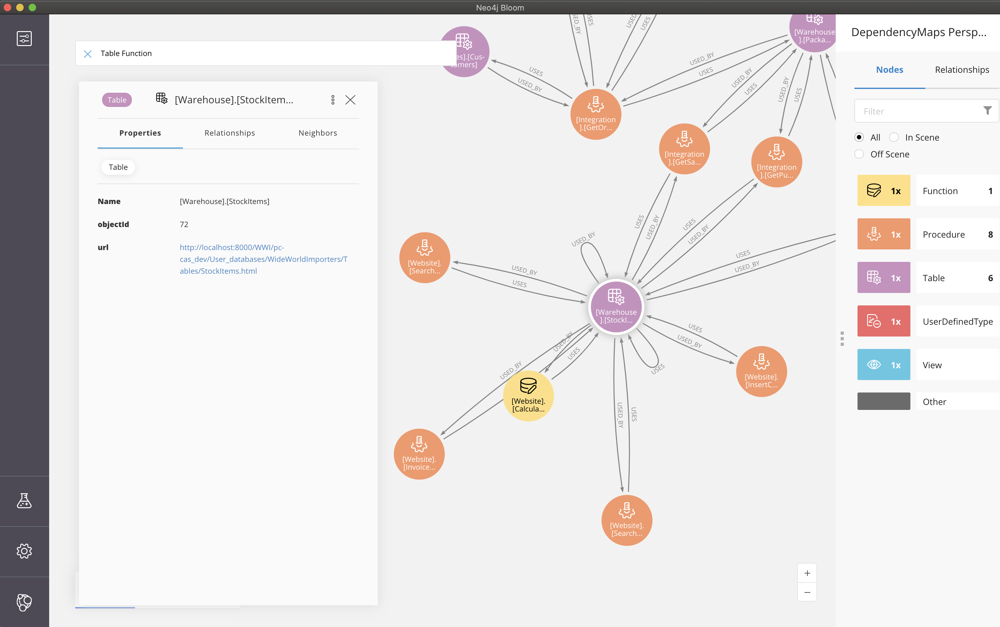

# neo4j-sql-dependency-docs
A sample use of Neo4j as a dependency map for a SQL Server schema, with links out to schema documentation

This project creates a dependency map (knowledge graph) in a Neo4j database. 

The source is a dependency file created by Redgate SQL Dependency Tracker (commercial software), although there are techniques (cited in various blogs) to use SQL schema objects to produce similar output.

The nodes in the graph also have a property to point to some html documentation, in this case produced by Redgate SQL Doc.

The graph can then be viewed in Neo4j Bloom to allow analysis and browsing of the dependencies (as seen below).

